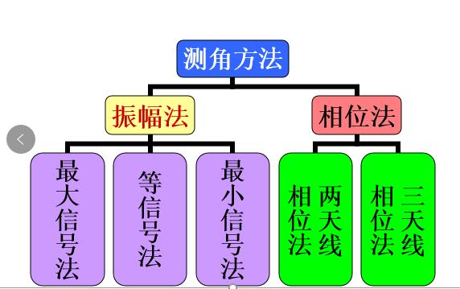
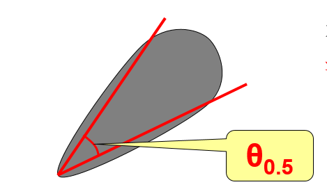

## 一、雷达坐标系

### （1）雷达基础
    1. 雷达主要由天线、发射机、接收机（包括信号处理机）和显示器等部分组成。
    雷达是近代的特殊的无线电观测设备，它是用以发现与测量目标位置的无线电技术仪器。
    如果将它的使用范围缩小来讲，就是测量无源活动目标（如飞机、军舰）的方位和距离的无线电技术仪器。

    2. 天线增益用来表示相对于各向同性天线，实际天线在辐射方向上功率增加的倍数。
### （2）雷达角度 (R,α,β)
#### 1）测角的物理基础
    1. 电磁波在均匀介质中以光速匀速直线传播
    2. 雷达天线具有方向性
#### 2）测角方法

#### 3）方位角α：
    基准为正北，顺时针方向为正

#### 4）俯仰角β：
    基准为水平面，向上方向为正

#### 5）天线方向图近似表示
    天线的方向性用方向性函数表示电场强度幅度的归一化 F(θ) = cos(nθ)，设G(t)表示信号沿主瓣方向的最大增益，则其他方向的天线增益克表示为G(t) * F(θ)
    波束宽度：波束两个半功率点之间的夹角。与天线增益有关，一般天线增益越大，波束就越窄，探测角分辨率就越高。
    水平波束宽度：在水平方向上，在最大辐射方向两侧，辐射功率下降3dB的两个方向的夹角。
    垂直波束宽度：在垂直方向上，在最大辐射方向两侧，辐射功率下降3dB的两个方向的夹角。
    半功率波束宽度约为 0.707，影响测角精度，副瓣电平，影响雷达的抗干扰性能
    雷达将相同距离上相互靠近的两个目标区分开的最小角度。

### （3）雷达测距:
        $2R=C t_r$, $t_r$ 为电磁波信号的延时,测得回拨延时$t_r$，即可测得目标距离

## 二、雷达方程
$$ P_r=\displaystyle \frac{P_rG_t}{4\pi R^2}\cdot\delta\cdot\frac{A_r}{4\pi R^2} $$

$P_r$：雷达发射功率 $G_t/G_r$：雷达天线增益
$R$：雷达距离目标距离 $A_r$：雷达接收天线面积
$σ$ ：雷达散射截面积
天线原理中接收面积和增益的关系:
$$G_r=\frac{4πA_r}{λ^2} $$
$$G_t=\frac{4πA_t}{λ^2} $$
$$P_r=  \frac{P_tG_rG_tσλ^2}{4πR^2\cdot4πR^2*4π} = \frac{P_tG_rG_tσλ^2}{(4π)^3 R^4}$$
当$P_r=S_{imin}$时求得雷达最大探测距离范围
$$R_{max}= [{\frac{P_t G_r G_t σλ^2}{S_{imin} {(4π)}^3}}]^{{1/4}}$$

## 三、雷达的频率应用与发展
## 四、雷达基础雷达发射机
## 五、雷达基础
## 六、雷达基础

#### Copyright (c) 2017 Copyright Holder All Rights Reserved.
